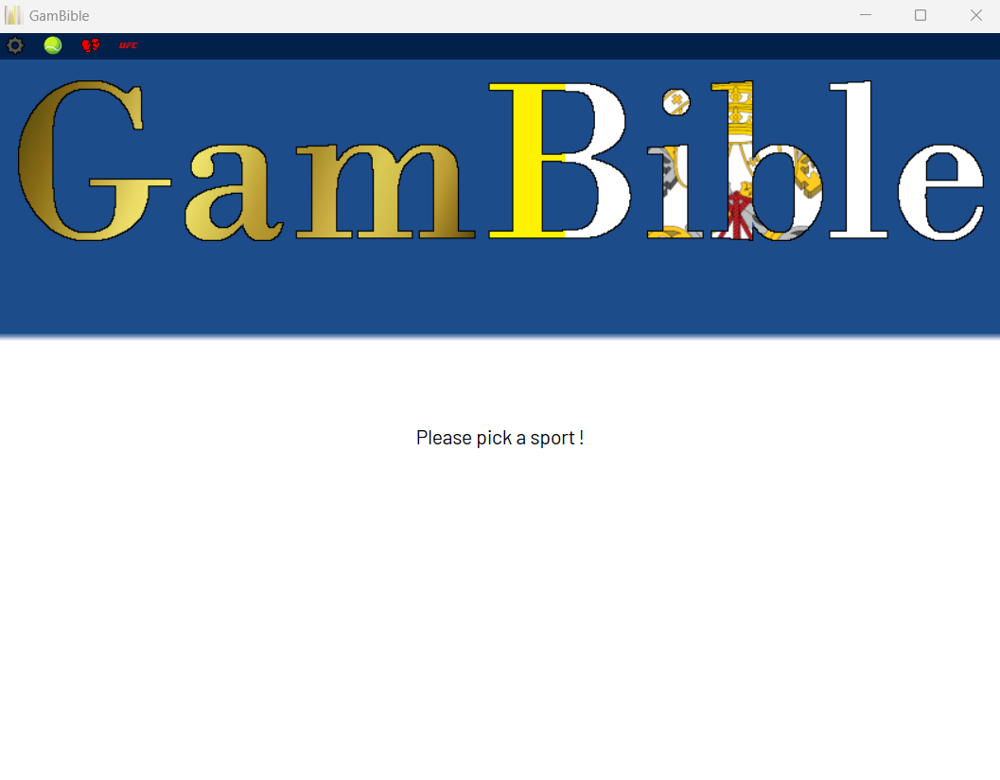
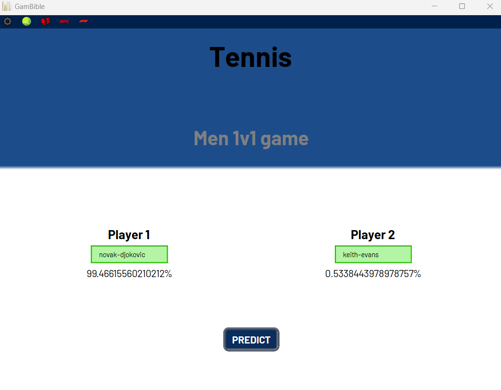
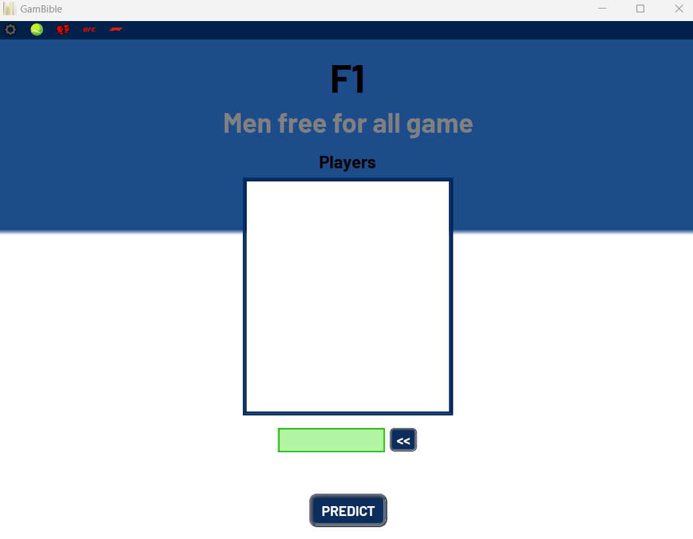
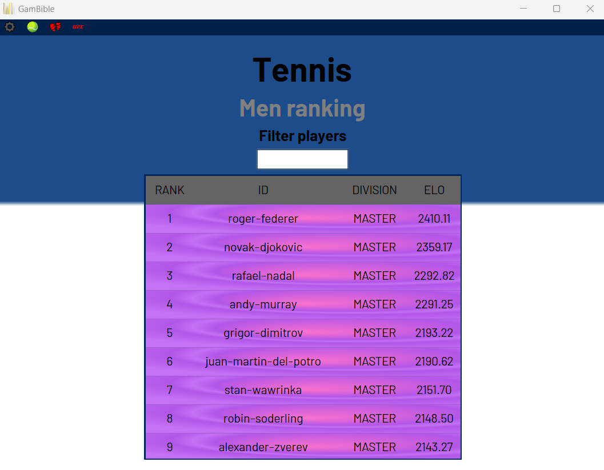

# GamBible V2.0

**@version:** 2.0  
**@author:** BoxBoxJason

## Context

GamBible's purpose is to make predictions about sport's event results.

- Predictions can be made for any type of sports that involve player vs player competition:
    - 1v1 games (tennis, boxing, chess, etc.)
    - 1v1 tournaments (tennis, boxing, chess, etc.)
    - Free-for-all games (horse race, F1, sprinting, etc.)
    - Team games (football, baseball, rugby, etc.)
- GamBible suggests a gambling amount based on the risk factor and the game rating on the betting platform.

## Disclaimer

- The Owner shall not be liable for any direct, indirect, incidental, consequential, or special damages arising out of or in connection with the use of copyrighted materials, including but not limited to errors, omissions, or inaccuracies in the content or loss or damage of any kind incurred as a result of the use of any copyrighted material.
- The use of this product is forbidden to anyone under the legal minimum gambling age.
- Gambling is a risky activity: Never gamble above what you can afford to lose.
- This product does not deliver absolute results, therefore do not follow it blindly.

## User Guide

To launch GamBible, simply run the `__main__.py` file with any Python 3.10 interpreter. This will start GamBible in its installed version, and the HMI will appear.

1. Pick the sports in which you want to make predictions in the top menu.
    

2. Fill the game/event information as displayed. You can choose to ask for a recommended gamble amount if you provide associated information.

### 1v1

Select both players, predict a win probability using the ELO algorithm.  
Use the auto-complete function of the search bar to find requested player.

### Free For All

### Team

### Ranking

Go through the ranking of registered players.  
You will be able to filter them by name using the included search bar.
## Technical summary

- Runs with Python 3.10
- Requirements:
    - Install PyQt6 on your local Python machine
    - Download BroCollect (Data collector/formatter tool created by @BoxBoxJason)
    - Build a subsequent database using BroCollect for every sport you need

The 'Results' folder will store the collected data and the generated analysis files for each sport. Whatever happens, NEVER manually change the content in the 'Results' folder.
